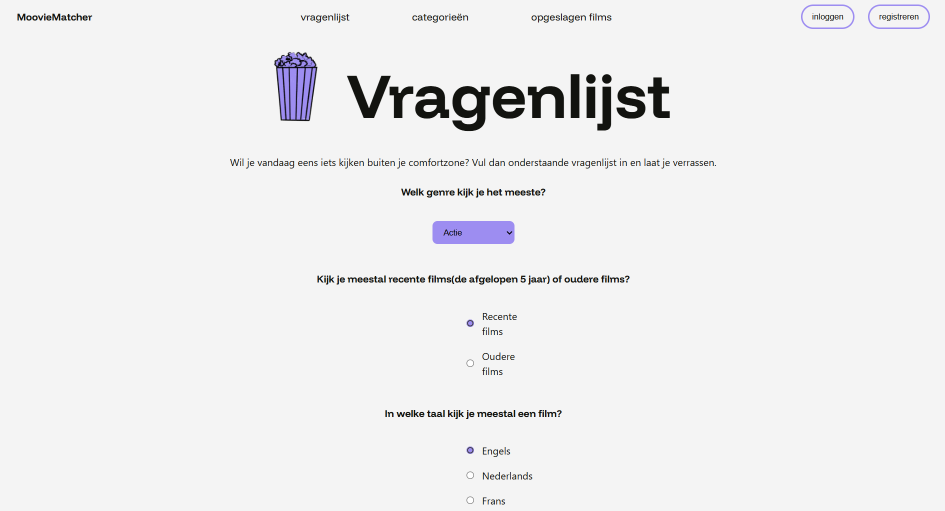

# Installatiehandleiding

Wat kun je verwachten van deze website: je kunt een vragenlijst invullen en zo aanbevelingen krijgen voor films om te kijken die je zullen verrassen. Daarnaast kun je ook een overzicht zien van de beschikbare films en een specifieke categorie kiezen om te zien welke films er in die categorie verschijnen. Ook is het mogelijk om een film op te slaan en deze terug te zien op een aparte pagina. En dit alles kun je alleen doen wanneer je ingelogd bent. Je registreert je eerst en het is ook mogelijk om uit te loggen.

Wat mogelijk is:
-	Een account aanmaken en daarmee inloggen en uitloggen.
-	Inzien welke films beschikbaar zijn en ze per categorie filteren.
-	Een vragenlijst invullen en op basis daarvan aanbevelingen ontvangen.
-	Films opslaan en terugzien op een pagina opgeslagen films.

Hier is alvast de hoofdpagina te zien:

Op deze pagina kun je een vragenlijst invullen en dan krijg je films aangeraden die buiten je comfortzone liggen. 

## benodigdheden

1.	Code editor
2.	node.js
3.	API key
4.	Project id

### 1 Code editor
Voor het maken van deze applicatie heb ik gebruik gemaakt van Webstorm. Maar ook een andere code editor zou gebruikt kunnen worden. Als je gebruik wilt maken van Webstorm zou je die hier kunnen downloaden en installeren: https://www.jetbrains.com/webstorm/download/?section=windows

### node.js
Node.js gebruik je om de code te runnen buiten de browser en daardoor is het straks mogelijk om de website te kunnen starten.
Via deze link kun je node.js downloaden: https://nodejs.org/en
Later in de handleiding is er een uitgebreidere uitleg over de installatie van node.js

### API key

### Project id